<div align="center">

# Heko | Ecommerce - Next.js + TypeScript


  

</div>

<div>
<br/>

 <h4 align="center">Demo: <a href="https://ecommerce-hekto-dl.vercel.app/">https://ecommerce-hekto-dl.vercel.app/</a></h4>

## Summary

1. [Getting started](#getting-started)
2. [Features](#features)
3. [About The Project](#about-the-project)
4. [Demo with Gif](#demo)
5. [File Structure](#file-structure)
6. [Database](#database)
7. [How to use](#how-to-use)

<!-- FEATURES -->

## Features

- ⚡️ Next.js 13
- ⚡️ Next Auth 4
- ⚛️ React 18 - Redux Toolkit
- ⛑ TypeScript
- 💖 React dnd — Drag and drop
- 🗂 React hook form + Yup - For validation form
- ⛑ Mongodb + Mongoose - For setup server
- ✨ Tailwind css
- 🗂 React Quill - For editor
<!-- - 📏 ESLint — To find and fix problems in your code -->
- 💖 Prettier — Code Formatter for consistent style
- 🐶 Multer + Cloudinary — For upload images
- 🚓 Nodemailer — For sendmail
- 🚫 Strip + Paypal — For payment
- ⚙️ EditorConfig - Consistent coding styles across editors and IDEs
- 🗂 Chart.js
- ‽ Either Error Handler - For error handling. (Either is designed to hold either a left or a right value but never both).

<!-- ABOUT THE PROJECT -->

## About The Project

I saw a UI design on [Figma](<https://www.figma.com/file/GIXFcdmd9tEiSEy6lrlBOk/Project---Hekto-(An-Ecommerce-Ui-Kit)-(Community)?type=design&node-id=87-622&t=JtW2exDkHFoC2LlZ-0>). And I wanted to code this design. So I decided to make it a full working website with NextJS but in just 2 - 3 week as challenge myself. Some issues are still there but I will check out them later.

<!-- DEMO -->

## Demo

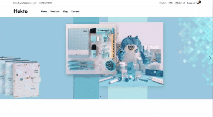
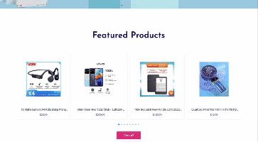
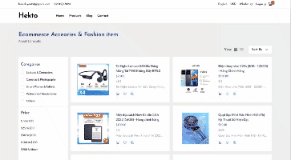
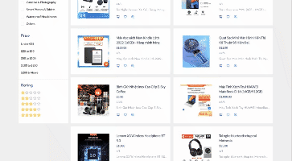
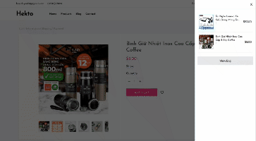
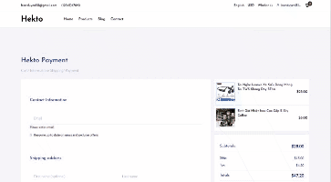
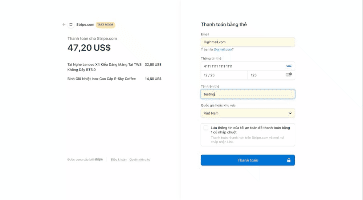
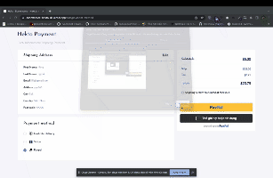

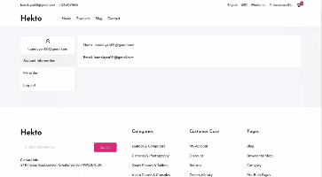
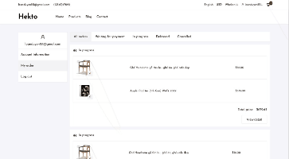
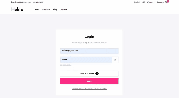
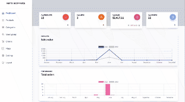
</div>

<!-- FILE STRUCTURE -->

## File Structure

While the boilerplate does primarily rely on the standard file structure of a Next.js project (anchored around the `/pages` directory), a few additions have been made. The following outlines the full structure of the boilerplate:

```
├── /components
│   ├── /Admin
│   ├── /Auth
│   ├── /Shared
│   │   └── /Common
│   └── ...
├── /helper
│   └── sendEmail.ts
├── /hooks
├── /lib
│   ├── mongodb.ts
│   └── mongoose.ts
├── /models
├── /pages
│   ├── /admin            -> admin page
│   │   ├── /categories   -> categories page
│   │   │   ├── /[slug]
│   │   │   │   └── [category_id]
│   │   │   │       └── index.tsx
│   │   │   └── index.tsx
│   │   ├── /products     -> products page
│   │   │   ├── /[slug]
│   │   │   │   └── [product_id]
│   │   │   │       └── index.tsx
│   │   │   └── index.tsx
│   │   ├── ...
│   │   ├── 404.tsx
│   │   └── index.tsx
│   ├── /api          -> route api
│   │   ├── /admin    -> api for admin
│   │   ├── /auth     -> ....
│   │   │   └── [...nextauth].tsx
│   │   └── ...
│   ├── /cart
│   │   └── [slug].tsx
│   ├── /checkout
│   │   └── [slug].tsx
│   ├── /orders       -> handle order success or error
│   │   └── index.tsx
│   ├── /products
│   │   ├── /[..slsug]
│   │   │   └── index.tsx
│   │   └── index.tsx
│   ├── /recover-password
│   │   └── index.tsx
│   ├── /reset-password
│   │   └── [token].tsx
│   ├── /user
│   │   │   ├── /orders
│   │   │   │   ├── [id].tsx    -> order detail
│   │   │   │   └── index.tsx   -> all orders of user
│   │   │   └── /profile        -> profile of user
│   │   ├── layout.tsx
│   │   ├── [id].tsx
│   │   └── index.tsx
│   ├── _app.tsx
│   ├── _document.tsx
│   ├── 404.tsx
│   ├── index.tsx
│   ├── login.tsx
│   ├── signup.tsx
│   └── ...
├── /public
│   ├── /fonts            -> fonts local
│   ├── /images           -> setup commonn axios services
│   └── ...
├── /services
│   ├── /Admin            -> service for admin page
│   ├── api-service.ts    -> setup commonn axios services
│   └── ...
├── /styles
│   └── index.css         -> included tailwindcss
├── /utils
│   ├── cloudinary.ts     -> setup cloudinary
│   ├── common.ts         -> all function common
│   ├── index.ts          -> export all file name in folder utils
│   ├── nprogress.ts      -> setup nprogress
│   └── withSesstion.ts   -> config allow cors
├── .env.development
├── .env.local
├── .env.production
├── .env.staging
├── .gitignore
├── .prettierrc
├── next.config.js
├── package-lock.json
├── package.json
├── postcss.config.js
├── README.md
├── tailwind.config.js
├── tsconfig.config.js
├── vercel.json
└── yarn.lock
```

## Database

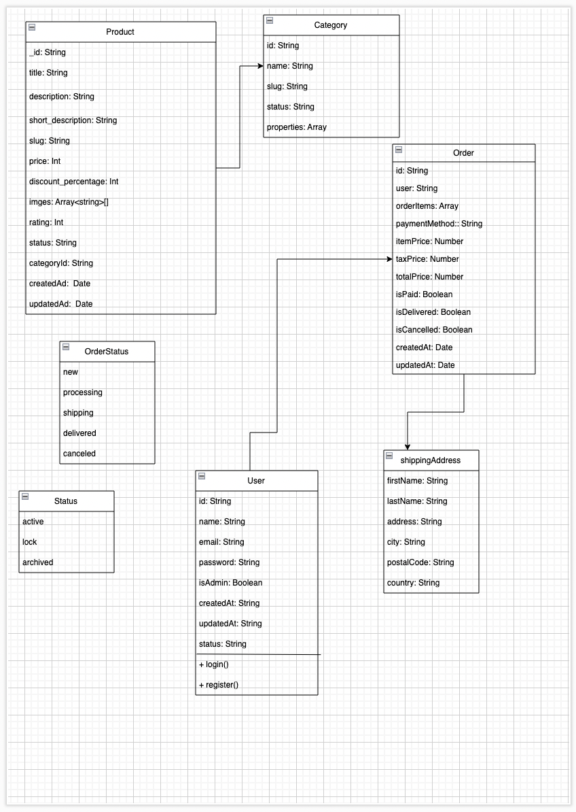
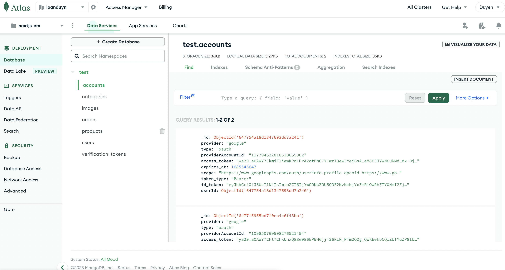

This is a really simple project that shows the usage of Next.js with TypeScript.

## How to use

```
$ git clone https://github.com/duyenlan151/ecommerce-hekto.git
$ cd ecommerce-hekto
$ npm install or yarn install
$ npm run dev or yarn deev
$ Api: http://localhost:3000/api/
$ Local: http://localhost:3000
```
